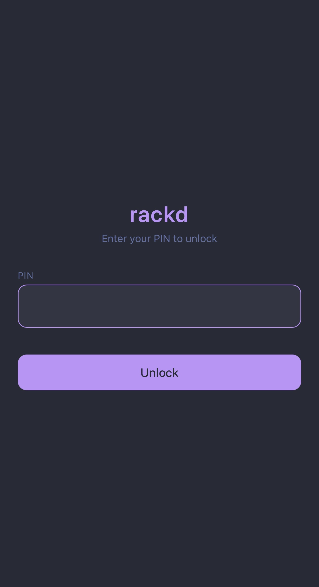
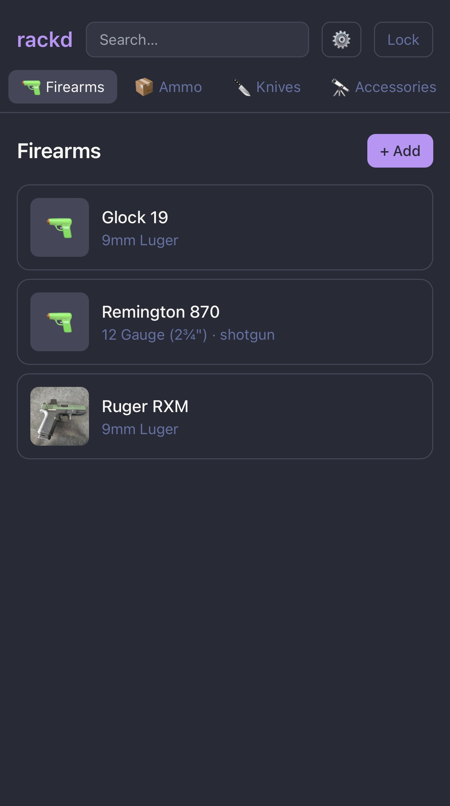
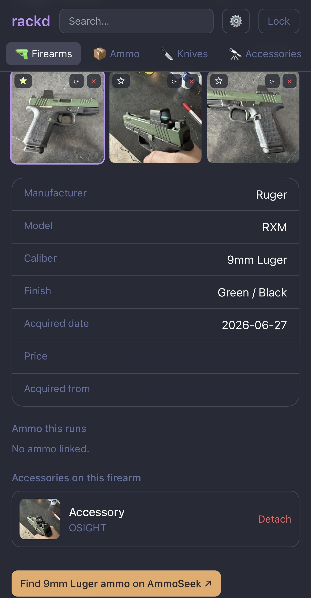

<div align="center">

# 🔒 Boating Accident

**A self-hosted, encrypted inventory for your firearms, ammo, knives, and accessories.**

Everything — serial numbers, photos, the whole list — is encrypted at rest and unlocked with a PIN, so a stolen disk or a leaked backup never exposes your collection. One Go binary with the web UI baked in. No cloud, no account, no telemetry.

[](LICENSE)
[](go.mod)
[](https://github.com/TheOutdoorProgrammer/boating-accident/pkgs/container/boating-accident)
[](https://github.com/TheOutdoorProgrammer/boating-accident/actions/workflows/docker.yml)

</div>

> [!NOTE]
> Boating Accident is a **personal inventory tool** — not a legal record, an ATF Form 4473, or compliance software. Don't rely on it for anything legal.

---

## Screenshots

<p align="center">
  
  &nbsp;
  
  &nbsp;
  
</p>

## Why

Existing trackers either do one thing (just ammo, or just guns) or bury a simple inventory under range-drill analytics and export pipelines. Boating Accident is the lean, unified core — catalog what you own, attach photos, note where you got it — with **real at-rest encryption** so the data is useless to anyone who doesn't have your PIN.

## Features

- **🔒 Encrypted at rest** — a 6-digit PIN unlocks an AES-256-GCM vault; serials, notes, and photos are never written to disk in the clear.
- **🔫 Firearms · 📦 ammo · 🔪 knives · 🔭 accessories** — full CRUD, one consistent UI.
- **📷 Encrypted photos** — uploads are EXIF-stripped (no GPS leaks), thumbnailed, and encrypted on disk. iPhone HEIC is converted in-browser, so the server stays CGO-free.
- **🔗 Ammo ↔ firearm links** — record what a gun runs, with notes ("zeroed load").
- **💵 Price checks** — per-caliber [AmmoSeek](https://ammoseek.com) restock links plus your own cost-per-round.
- **📖 Free spec lookup** — search Wikipedia / DBpedia for a firearm and review its spec sheet before filling fields. No API key.
- **🔎 Search + dashboard** — one search box across everything; collection value + counts at a glance.
- **📱 Mobile-first** — designed for your phone, Dracula-themed.
- **📦 Single binary** — Go backend + embedded React SPA + SQLite. Nothing else to run.

## Security model

```
6-digit PIN ──Argon2id──▶ key-encryption key ──unwraps──▶ random 256-bit data key (AES-256-GCM)
                                                              │
                                  encrypts every content field + every uploaded file
```

- The data key lives **only in memory** while unlocked. Locking the vault or restarting the process drops it — the vault is sealed again until the PIN is re-entered.
- Changing the PIN re-wraps the data key; your data is never re-encrypted.
- Online PIN guessing is throttled with exponential backoff.

> [!WARNING]
> A short PIN is only as strong as the effort to brute-force it **offline** if someone gets your database file. Argon2id makes that expensive, not impossible. Keep the DB on trusted hardware, and use a longer passcode for any off-box backups.

## Quick start

### Docker

```sh
docker run -d --name boating-accident -p 8080:8080 -v boating-accident-data:/data \
  -e BOAT_DEV=true \
  ghcr.io/theoutdoorprogrammer/boating-accident:latest
```

Open <http://localhost:8080> and set a 6-digit PIN. (`BOAT_DEV=true` lets the session cookie work over plain `http` for local testing — behind HTTPS, leave it `false`.)

### docker-compose

```sh
docker compose up -d
```

See [`docker-compose.yml`](docker-compose.yml).

### From source

```sh
cd web && npm install && npm run build && cd ..
go run ./cmd/boating-accident
```

## Configuration

All settings are optional environment variables:

| Variable | Default | Description |
| --- | --- | --- |
| `BOAT_ADDR` | `:8080` | Listen address |
| `BOAT_DATA_DIR` | `./data` | SQLite DB + encrypted uploads |
| `BOAT_DEV` | `false` | Relax the `Secure` cookie flag for local `http` (never in prod) |
| `BOAT_ARGON2_MEMORY_MB` | `256` | Argon2id memory cost (new vaults only) |
| `BOAT_ARGON2_TIME` | `4` | Argon2id iterations |
| `BOAT_ARGON2_THREADS` | `4` | Argon2id parallelism |

## Integrations

- **AmmoSeek** — deep links only. AmmoSeek's ToS prohibits automated access, so Boating Accident never scrapes it; it just opens their per-caliber page in your browser.
- **Spec lookup** — Wikipedia full-text search → DBpedia infobox, key-less and cached indefinitely. Community-sourced, so you **review before it fills** anything.

## How it works

Go ([chi](https://github.com/go-chi/chi), [modernc sqlite](https://modernc.org/sqlite), [goose](https://github.com/pressly/goose)) serves a React 19 + Vite + Tailwind SPA embedded via `//go:embed` — so the whole app ships as one static, CGO-free binary. All state lives in `BOAT_DATA_DIR` (the SQLite database + encrypted upload blobs).

## Self-hosting notes

- Run it behind a **TLS-terminating reverse proxy** (Caddy, Traefik, nginx).
- It holds sensitive data — keep it **LAN-only or behind a VPN**. Don't expose it to the internet.
- **Back up `/data`** — it's your encrypted DB and photos. (See the PIN-strength warning above before putting backups anywhere off-box.)

## Contributing

PRs welcome — see [CONTRIBUTING.md](CONTRIBUTING.md).

## License

[MIT](LICENSE) © Joey Stout
